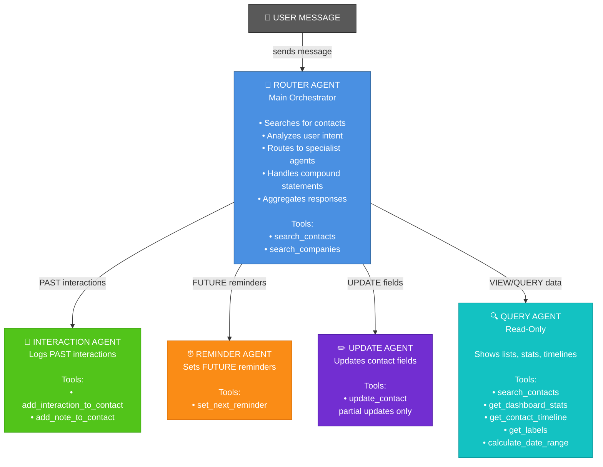

# Multi-Agent Architecture - Current State

## Agent Diagram



## Flow Examples

### 1. Simple Past Interaction
```
User: "Talked to John yesterday"
  ↓
Router: searches "John" → finds John (ID: abc123)
  ↓
Router: detects PAST interaction → hands to Interaction Agent
  ↓
Interaction Agent: logs interaction with John, date = yesterday
  ↓
Router: returns "Logged call with John"
```

### 2. Simple Future Reminder
```
User: "Meet Sarah on Friday"
  ↓
Router: searches "Sarah" → finds Sarah (ID: xyz789)
  ↓
Router: detects FUTURE action → hands to Reminder Agent
  ↓
Reminder Agent: sets nextReminderDate = Friday for Sarah
  ↓
Router: returns "Set reminder for Sarah on Friday"
```

### 3. Compound Statement (BOTH past AND future)
```
User: "Talked to Mike, he wants to meet Oct 28th"
  ↓
Router: searches "Mike" → finds Mike (ID: def456)
  ↓
Router: detects COMPOUND (past + future)
  ↓
Router: hands to Interaction Agent → logs "talked to Mike"
  ↓ (waits for completion)
Router: hands to Reminder Agent → sets reminder for Oct 28th
  ↓
Router: aggregates both results
  ↓
Router: returns "Logged call with Mike. Set reminder for Oct 28th"
```

### 4. Disambiguation
```
User: "Talked to Alex"
  ↓
Router: searches "Alex" → finds 5 matches
  ↓
Router: asks "I found multiple matches:
         1) Alex Hoff - alex.hoff@...
         2) Alex Braive - alex.braive@...
         Which one did you mean?"
  ↓
User: "1"
  ↓
Router: resolves to Alex Hoff (ID: ghi789)
  ↓
Router: continues with original intent (log interaction)
```

### 5. Query (Read-Only)
```
User: "Show my overdue contacts"
  ↓
Router: detects QUERY (no specific contact)
  ↓
Router: hands directly to Query Agent
  ↓
Query Agent: searches contacts with filter:
  • nextReminderDate < today
  • teamMember = current user
  ↓
Query Agent: returns formatted list
  ↓
Router: returns list to user
```

### 6. Update Contact
```
User: "Update Jane's title to CEO"
  ↓
Router: searches "Jane" → finds Jane (ID: jkl012)
  ↓
Router: detects UPDATE intent → hands to Update Agent
  ↓
Update Agent: calls update_contact(id=jkl012, jobTitle="CEO")
  ↓ (only jobTitle passed - partial update)
Router: returns "Updated Jane's title to CEO"
```

## Key Design Principles

1. **Router is the Orchestrator**
   - All requests go through Router first
   - Router has search tools and performs disambiguation
   - Router decides which specialist agent(s) to invoke
   - Router aggregates responses from multiple agents

2. **Specialist Agents Do One Thing Well**
   - Interaction Agent: ONLY logs past interactions
   - Reminder Agent: ONLY sets future reminders
   - Update Agent: ONLY updates contact fields (partial updates)
   - Query Agent: ONLY reads and displays data (no writes)

3. **No Cross-Agent Communication**
   - Agents never hand off to each other directly
   - Router handles all sequencing and coordination
   - This keeps agents simple and focused

4. **User Sees Clean Results**
   - No mention of "transferring to X Agent"
   - No internal implementation details leaked
   - Just the final result: "Logged call. Set reminder."

5. **Search Filtering**
   - Searches are NOT filtered by team member (users can interact with any contact)
   - Queries with "my" keyword DO filter by team member (e.g., "show my overdue contacts")

## Agent Responsibilities

| Agent | Responsibility | Can Write? | Can Search? | Handoffs |
|-------|---------------|-----------|-------------|----------|
| **Router** | Orchestrate, search, route | No | Yes | All agents |
| **Interaction** | Log past interactions | Yes | No | None |
| **Reminder** | Set future reminders | Yes | No | None |
| **Update** | Update contact fields | Yes | No | None |
| **Query** | Show lists/stats/timeline | No | Yes | None |

## Implementation Details

### Router Agent Tools
- `search_contacts(search, teamMember?, company?, label?, limit)` - Search all contacts
- `search_companies(search, limit)` - Search companies

### Interaction Agent Tools
- `add_interaction_to_contact(contactId, type, content, interactionDate?, teamMemberId, updateLastTouch)` - Log past interaction
- `add_note_to_contact(contactId, content, teamMemberId, noteDate?)` - Add general note

### Reminder Agent Tools
- `set_next_reminder(contactId, reminderDate)` - Set future reminder date

### Update Agent Tools
- `update_contact(id, ...fields)` - Update specific contact fields (partial update)

### Query Agent Tools
- `search_contacts(...)` - Search with filters
- `get_dashboard_stats(teamMember?)` - Get stats
- `get_contact_timeline(contactId)` - Get interaction history
- `get_labels()` - List all labels
- `calculate_date_range(range)` - Calculate date ranges

## Testing Strategy

E2E tests verify:
1. ✅ Disambiguation works (multiple matches → ask user)
2. ✅ Past interactions logged correctly
3. ✅ Future reminders set correctly
4. ✅ Compound statements handled (both past + future)
5. ⚠️  Partial updates (agent works, API has bug)
6. Query operations (read-only, no side effects)
